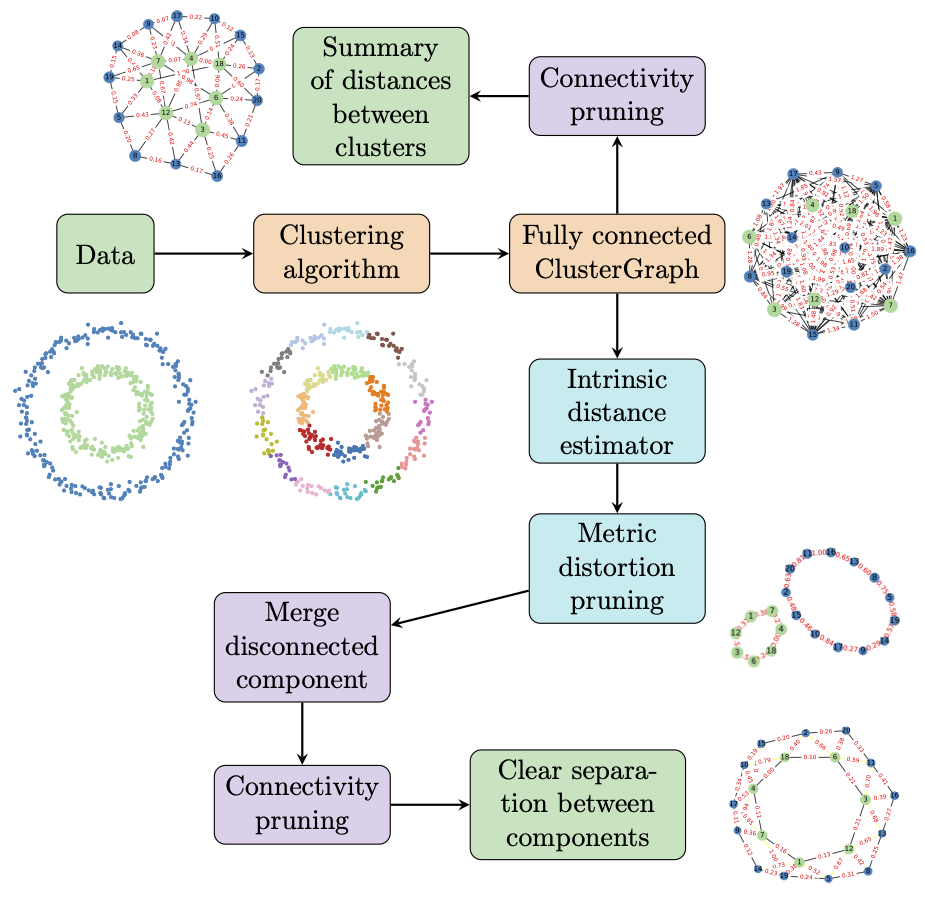
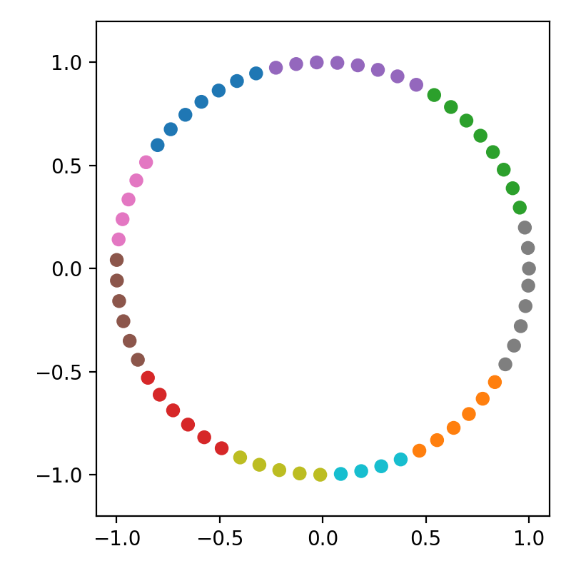
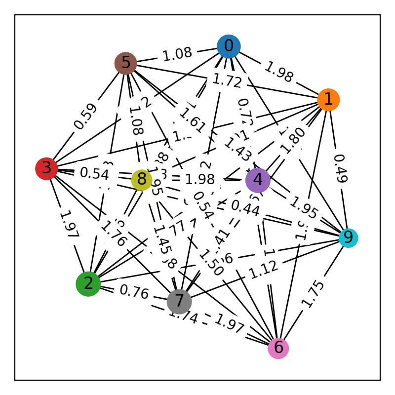
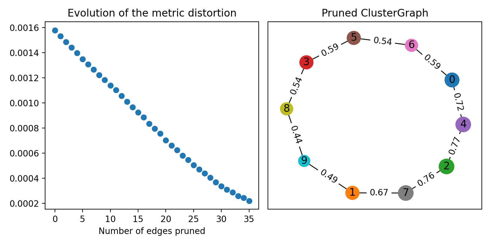

# ClusterGraph

[](https://pypi.org/project/clustergraph/)
[](https://clustergraph.readthedocs.io)

ClusterGraph is a tool which allows the visualization of the geometric organization of clusters.

It consists of a fully connected graph built on the output of a clustering algorithm, applied to a dataset. Each vertex corresponds to a specific cluster. 
Two vertices are connected by an edge whose length corresponds to the distance between their respective clusters.  

Edges that do not contribute to the geometric organization can subsequently be removed, in order to obtain a simpler visualization.  

More information can be found the accompanying paper _"ClusterGraph: a new tool for visualization and compression of multidimensional data" [arXiv:2411.05443](https://arxiv.org/abs/2411.05443)_. 


<picture>
  
</picture>

## Install the package 📦   
ClusterGraph is avaliable on pypi and can be installed via the following command
```
pip install clustergraph
```

## Basic usage

Let `X` be a dataset, for example points sampled from a circle.
```python
X = np.array([[np.cos(x), np.sin(x)] for x in np.arange(0, 6.3, 0.1)])
```

We first run a clustering algorithm. 

```python
from sklearn.cluster import KMeans

model_KM = KMeans(10, random_state=42)
pred = model_KM.fit_predict(X)
```

<picture>
  
</picture>


Then we build a ClusterGraph on top of it
```python
import clustergraph.clustergraph as cg
from clustergraph.utils import get_clusters_from_scikit
from clustergraph.plot_graph import draw_graph

cluster_g = cg.ClusterGraph(
    clusters=get_clusters_from_scikit(pred), 
    X=X, 
    metric_clusters="average"
)

# Coloring the graph
cluster_g.color_graph(
    node_color_labels=pred,
    node_palette=cm.get_cmap("tab10"),
)

fig, ax = plt.subplots(figsize=(4, 4))
draw_graph(cluster_g.Graph, ax=ax)
```

<picture>
  
</picture>


```python
metric_distortion_graph, md = cluster_g.prune_distortion(knn_g=5, score=True)

fig, (ax1, ax2) = plt.subplots(ncols=2, figsize=(8, 4))

ax1.scatter(range(len(md)), md)
ax1.set_title("Evolution of the metric distortion")
ax1.set_xlabel("Number of edges pruned")

ax2.set_title("Pruned ClusterGraph")
metric_distortion_graph = cluster_g.prune_distortion()
draw_graph(metric_distortion_graph, ax=ax2)
```

<picture>
  
</picture>

For more examples, check out the [example notebooks](https://github.com/dioscuri-tda/clustergraph/tree/main/examples) or the [documentation](https://clustergraph.readthedocs.io).


## References
If you find this package useful please cite
```
Dłotko, P., Gurnari, D., Hallier, M., & Jurek-Loughrey, A. (2024). "ClusterGraph: a new tool for visualization and compression of multidimensional data". arXiv preprint arXiv:2411.05443.
```

## Licensing
- **Code**: Licensed under the [MIT License](./LICENSE).
- **Example data**: Dedicated to the public domain under [CC0 1.0 Universal](./LICENSE-DATA.txt).
