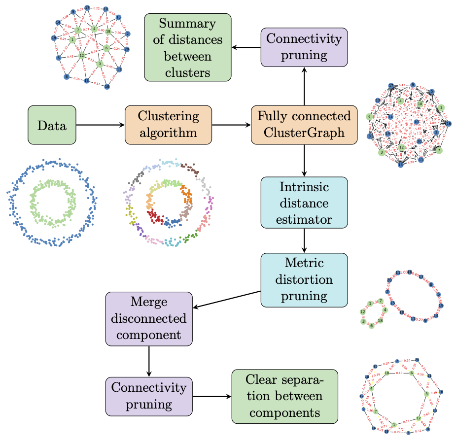

# Getting started with ClusterGraph

[](https://pypi.org/project/clustergraph/)
[](https://clustergraph.readthedocs.io/en/latest/?badge=latest)

ClusterGraph is a tool that enables the visualization of the geometric organization of clusters in your data.

It creates a fully connected graph from the output of a clustering algorithm, where each vertex corresponds to a specific cluster. Two vertices are connected by an edge whose length corresponds to the distance between the clusters.

Edges that do not contribute meaningfully to the geometric organization can be removed, resulting in a simpler and more interpretable visualization.

More information can be found the accompagning paper _"ClusterGraph: a new tool for visualization and compression of multidimensional data" [arXiv:2411.05443](https://arxiv.org/abs/2411.05443)_. 


<picture>
  
</picture>

## Install the package 📦   
ClusterGraph is available on PyPI and can be installed via the following command:
```
pip install clustergraph
```

## Basic usage

Let’s start with an example using a simple dataset: points sampled from a circle.
```python
X = np.array([[np.cos(x), np.sin(x)] for x in np.arange(0, 6.3, 0.1)])
```

### Step 1: Run a clustering algorithm 
We will use **KMeans** clustering from `scikit-learn` to cluster the points.

```python
from sklearn.cluster import KMeans

model_KM = KMeans(10, random_state=42)
pred = model_KM.fit_predict(X)
```

<picture>
  
</picture>

### Step 2: Build the ClusterGraph 
Next, we create a ClusterGraph based on the clustering results.
```python
import clustergraph.clustergraph as cg
from clustergraph.utils import get_clusters_from_scikit
from clustergraph.plot_graph import draw_graph

# Create a ClusterGraph instance
cluster_g = cg.ClusterGraph(
    clusters=get_clusters_from_scikit(pred), 
    X=X, 
    metric_clusters="average"
)

# Color the graph nodes based on cluster labels
cluster_g.color_graph(
    node_color_labels=pred,
    node_palette=cm.get_cmap("tab10"),
)

# Plot the full ClusterGraph
import matplotlib.pyplot as plt
fig, ax = plt.subplots(figsize=(4, 4))
draw_graph(cluster_g.Graph, ax=ax)

```

<picture>
  
</picture>

### Step 3: Prune the ClusterGraph 
To simplify the graph, we can prune edges based on **metric distortion**. The `prune_distortion()` method removes edges that cause high metric distortion in the ClusterGraph.

```python
# Prune edges based on metric distortion
metric_distortion_graph, md = cluster_g.prune_distortion(knn_g=5, score=True)

# Visualize the pruning process
fig, (ax1, ax2) = plt.subplots(ncols=2, figsize=(8, 4))

ax1.scatter(range(len(md)), md)
ax1.set_title("Evolution of Metric Distortion")
ax1.set_xlabel("Number of Edges Pruned")

ax2.set_title("Pruned ClusterGraph")
metric_distortion_graph = cluster_g.prune_distortion()
draw_graph(metric_distortion_graph, ax=ax2)

```

<picture>
  
</picture>

For more examples, check out the [example notebooks](https://github.com/dioscuri-tda/clustergraph/tree/main/examples) or the [documentation](https://clustergraph.readthedocs.io).


## References
If you find ClusterGraph useful, please consider citing our work:
```bibtex
@misc{dłotko2024clustergraphnewtoolvisualization,
      title={ClusterGraph: a new tool for visualization and compression of multidimensional data}, 
      author={Paweł Dłotko and Davide Gurnari and Mathis Hallier and Anna Jurek-Loughrey},
      year={2024},
      eprint={2411.05443},
      archivePrefix={arXiv},
      primaryClass={cs.CG},
      url={https://arxiv.org/abs/2411.05443}, 
}
```
