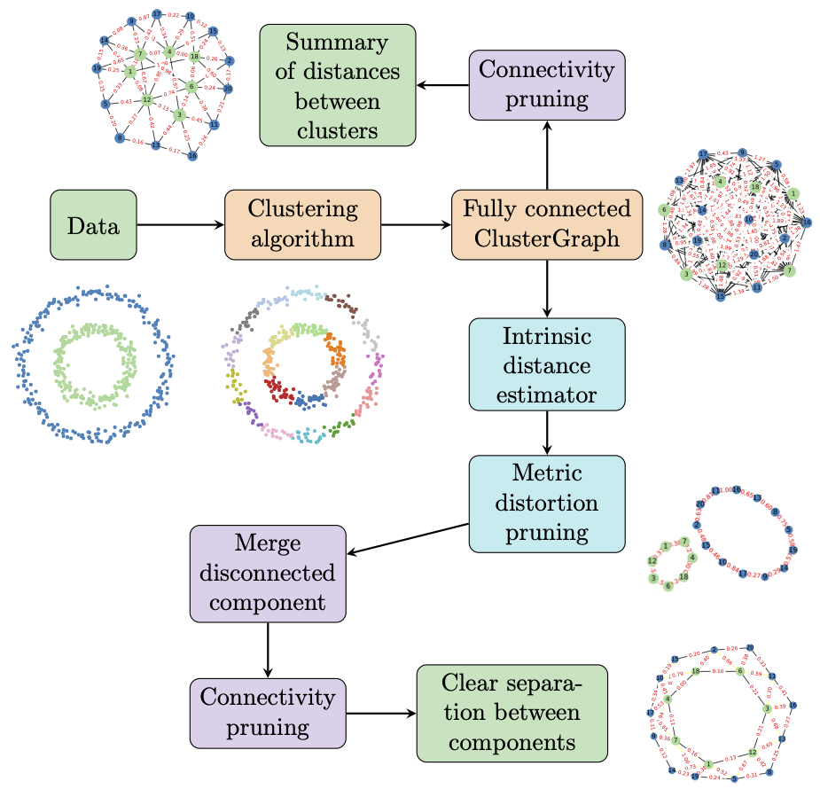

Welcome to ClusterGraph's documentation!
========================================

ClusterGraph is a tool which allows the visualization of the geometric organization of clusters.

It consists of a fully connected graph built on the output of a clustering algorithm, applied to a dataset. Each vertex corresponds to a specific cluster. 
Two vertices are connected by an edge whose length corresponds to the distance between their respective clusters.  

Edges that do not contribute to the geometric organization can subsequently be removed, in order to obtain a simpler visualization.  

More information can be found in the accompanying paper *"ClusterGraph: a new tool for visualization and compression of multidimensional data"* `arXiv:2411.05443 <https://arxiv.org/abs/2411.05443>`_.

.. toctree::
   :maxdepth: 1
   :caption: Contents:

   installation
   getting_started.md
   pruning.md
   API

Indices and tables
==================
* :ref:`genindex`
* :ref:`modindex`
* :ref:`search`
